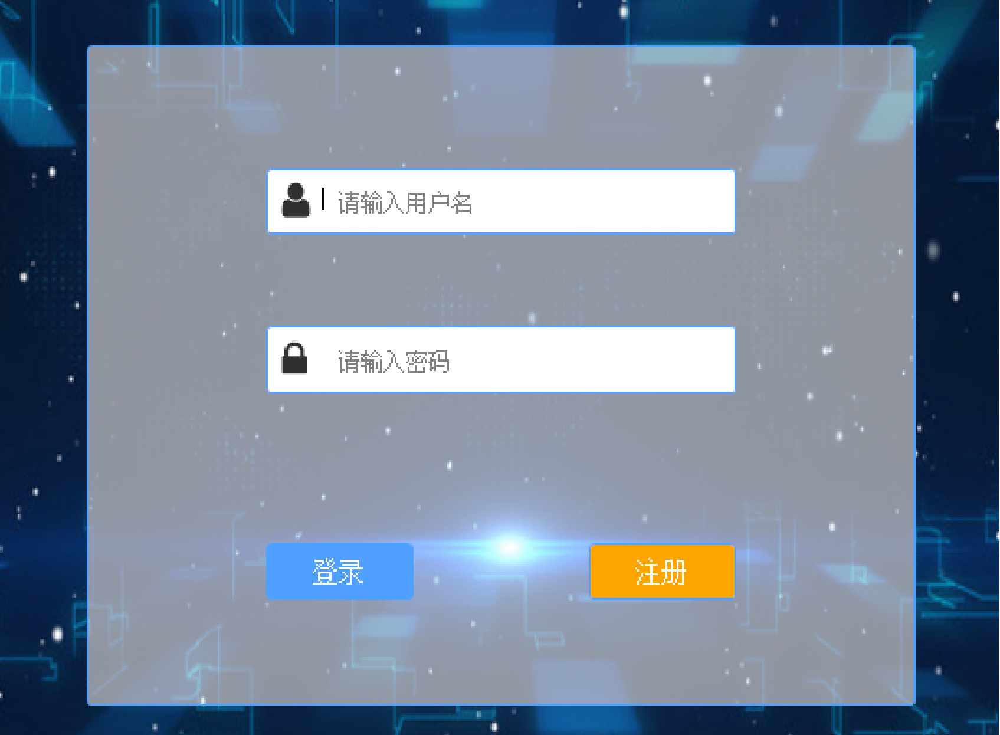
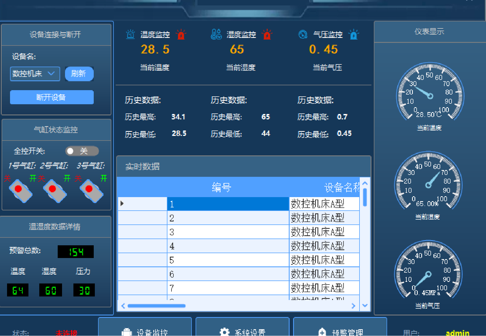
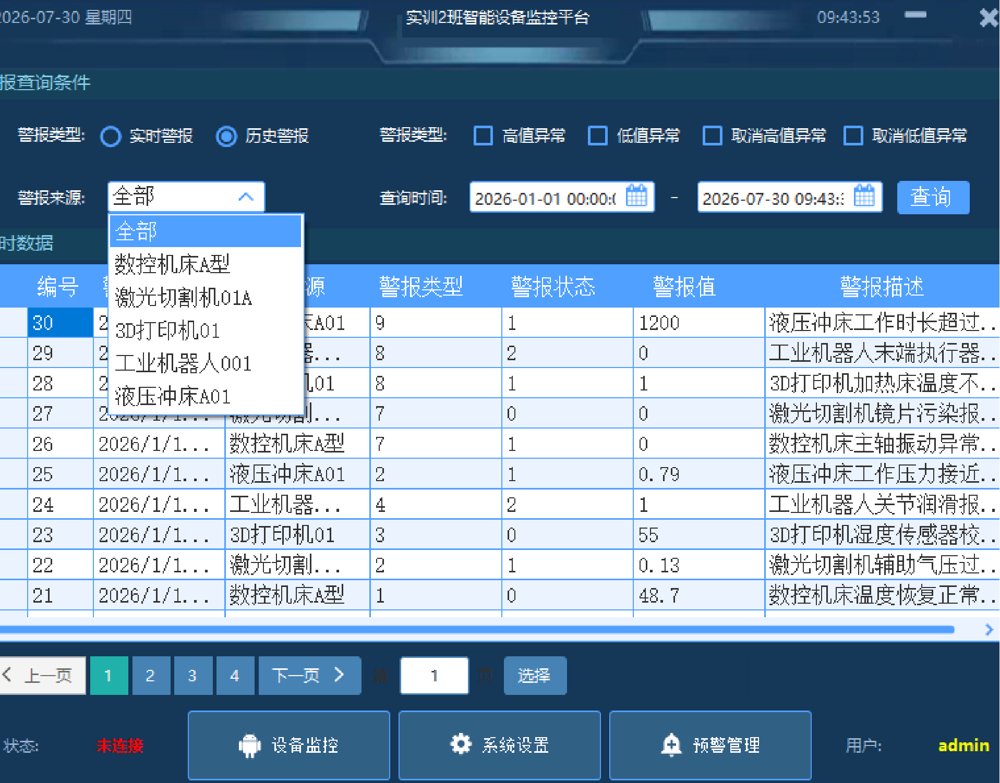

# 可交互监控平台

## 项目简介
本项目为专业实习期间独立开发的桌面端监控平台，基于 C# / .NET WinForms 实现。系统模拟真实场景下的设备状态监测与反向控制，具备完整的“监测—交互—反馈”闭环。

## 技术栈
- 语言：C#
- 框架：.NET Framework / WinForms
- 开发工具：Visual Studio
- 关键技术：事件驱动编程、多线程/异步处理、GDI+绘图、双缓冲

## 核心功能
- **实时监测**：定时刷新模拟设备状态，界面实时展示数据变化
- **反向控制**：通过界面按钮向模拟设备发送指令，并实时回显执行结果
- **可视化展示**：使用自定义控件与 GDI+ 绘制状态图表，界面流畅不闪烁
- **日志记录**：操作指令与状态变化自动记录，方便追溯

## 运行截图




## 如何运行
1. 克隆本仓库到本地：
   ```bash
   git clone https://github.com/evayyp/winforms-monitor-platform.git
